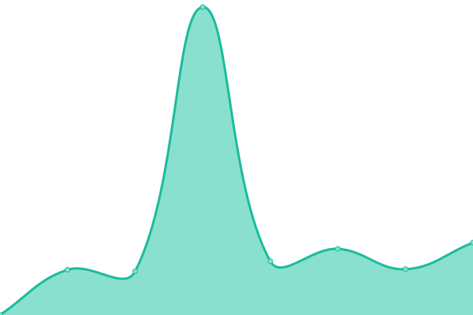
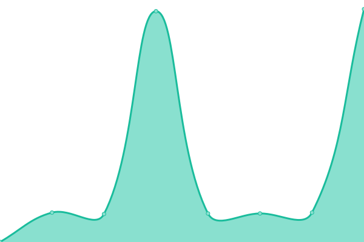

# [📈 Live Status](https://LarsK1.github.io/monitoring): <!--live status--> **🟩 All systems operational**

This repository contains the open-source uptime monitor and status page for [Lars Kusch](http://lars-kusch.de), powered by [Upptime](https://github.com/upptime/upptime).

With [Upptime](https://upptime.js.org), you can get your own unlimited and free uptime monitor and status page, powered entirely by a GitHub repository. We use [Issues](https://github.com/LarsK1/monitoring/issues) as incident reports, [Actions](https://github.com/LarsK1/monitoring/actions) as uptime monitors, and [Pages](https://LarsK1.github.io/monitoring) for the status page.

<!--start: status pages-->
<!-- This summary is generated by Upptime (https://github.com/upptime/upptime) -->
<!-- Do not edit this manually, your changes will be overwritten -->
<!-- prettier-ignore -->
| URL | Status | History | Response Time | Uptime |
| --- | ------ | ------- | ------------- | ------ |
|  [Blumagine](https://blumagine.de) | 🟩 Up | [blumagine.yml](https://github.com/LarsK1/monitoring/commits/HEAD/history/blumagine.yml) | 

 746ms
     
 | 

<a href="https://LarsK1.github.io/monitoring/history/blumagine">100.00%</a>
    

|  [Monitoring](https://monitoring.blumagine.de) | 🟩 Up | [monitoring.yml](https://github.com/LarsK1/monitoring/commits/HEAD/history/monitoring.yml) | 

 689ms
     
 | 

<a href="https://LarsK1.github.io/monitoring/history/monitoring">100.00%</a>
    

|  [E-Mail-Security](https://security.blumagine.de) | 🟩 Up | [e-mail-security.yml](https://github.com/LarsK1/monitoring/commits/HEAD/history/e-mail-security.yml) | 

 1461ms
     
 | 

<a href="https://LarsK1.github.io/monitoring/history/e-mail-security">100.00%</a>
    

<!--end: status pages-->

[**Visit our status website →**](https://LarsK1.github.io/monitoring)

## 📄 License

- Powered by: [Upptime](https://github.com/upptime/upptime)
- Code: [MIT](./LICENSE) © [Lars Kusch](http://lars-kusch.de)
- Data in the `./history` directory: [Open Database License](https://opendatacommons.org/licenses/odbl/1-0/)
